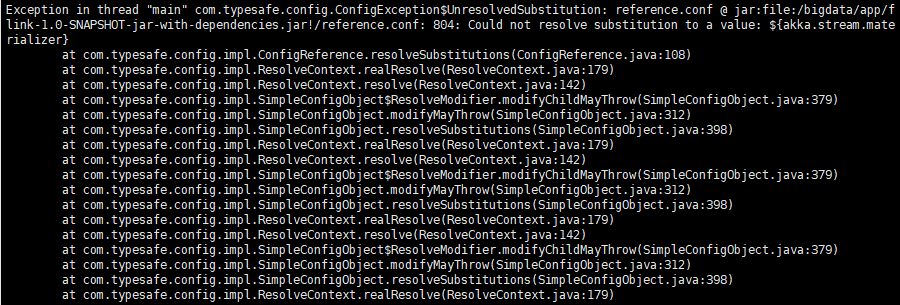

# 异常

``` xml
1.could not find implicit value for evidence parameter of type TypeInformation[String]
解决方法
import org.apache.flink.streaming.api.scala. _
```

```xml
2.IllegalStateException: No operators defined in streaming topology. Cannot execute.
解决方法
print()加上这个行动算子，流拓扑才会工作
```

```xml
3.Flink Could not resolve substitution to a value: ${akka.stream.materializer}
报错现象：

Exception in thread "main" com.typesafe.config.ConfigException$UnresolvedSubstitution: reference.conf @ jar:file:/bigdata/app/flink-1.0-SNAPSHOT-jar-with-dependencies.jar!/reference.conf: 804: Could not resolve substitution to a value: ${akka.stream.materializer}
解决方案:
pom文件里面添加：
<transformer implementation="org.apache.maven.plugins.shade.resource.AppendingTransformer">
     <resource>reference.conf</resource>
</transformer>
完整代码
<?xml version="1.0" encoding="UTF-8"?>
<project xmlns="http://maven.apache.org/POM/4.0.0"
         xmlns:xsi="http://www.w3.org/2001/XMLSchema-instance"
         xsi:schemaLocation="http://maven.apache.org/POM/4.0.0 http://maven.apache.org/xsd/maven-4.0.0.xsd">
    <modelVersion>4.0.0</modelVersion>

    <groupId>yk.bigdate</groupId>
    <artifactId>flinkHDFS</artifactId>
    <version>1.0-SNAPSHOT</version>

    <properties>
        <project.build.sourceEncoding>UTF-8</project.build.sourceEncoding>
        <flink.version>1.6.1</flink.version>
        <slf4j.version>1.7.7</slf4j.version>
        <log4j.version>1.2.17</log4j.version>
    </properties>

    <dependencies>
        <!--******************* flink *******************-->
        <dependency>
            <groupId>org.apache.flink</groupId>
            <artifactId>flink-java</artifactId>
            <version>${flink.version}</version>
        </dependency>
        <dependency>
            <groupId>org.apache.flink</groupId>
            <artifactId>flink-streaming-java_2.11</artifactId>
            <version>${flink.version}</version>
        </dependency>

        <dependency>
            <groupId>org.apache.flink</groupId>
            <artifactId>flink-connector-kafka-0.11_2.11</artifactId>
            <version>${flink.version}</version>
            <scope> compile</scope>
        </dependency>
        <dependency>
            <groupId>org.apache.flink</groupId>
            <artifactId>flink-connector-filesystem_2.11</artifactId>
            <version>${flink.version}</version>
        </dependency>

        <dependency>
            <groupId>org.apache.hadoop</groupId>
            <artifactId>hadoop-core</artifactId>
            <version>1.1.0</version>
        </dependency>
       <!-- <!– https://mvnrepository.com/artifact/org.apache.hadoop/hadoop-common –>
        <dependency>
            <groupId>org.apache.hadoop</groupId>
            <artifactId>hadoop-common</artifactId>
            <version>3.1.0</version>
        </dependency>
        <!– https://mvnrepository.com/artifact/org.apache.hadoop/hadoop-hdfs –>
        <dependency>
            <groupId>org.apache.hadoop</groupId>
            <artifactId>hadoop-hdfs</artifactId>
            <version>3.1.0</version>
        </dependency>
        <!– https://mvnrepository.com/artifact/org.apache.hadoop/hadoop-client –>
        <dependency>
            <groupId>org.apache.hadoop</groupId>
            <artifactId>hadoop-client</artifactId>
            <version>3.1.0</version>
        </dependency>-->

        <!--<dependency>
            <groupId>org.apache.flink</groupId>
            <artifactId>flink-hadoop-fs</artifactId>
            <version>${flink.version}</version>
        </dependency>-->

        <!--******************* 日志 *******************-->
        <dependency>
            <groupId>org.slf4j</groupId>
            <artifactId>slf4j-log4j12</artifactId>
            <version>${slf4j.version}</version>
            <scope>runtime</scope>
        </dependency>
        <dependency>
            <groupId>log4j</groupId>
            <artifactId>log4j</artifactId>
            <version>${log4j.version}</version>
            <scope>runtime</scope>
        </dependency>
        <!--******************* kafka *******************-->
        <dependency>
            <groupId>org.apache.kafka</groupId>
            <artifactId>kafka-clients</artifactId>
            <version>1.1.1</version>
        </dependency>

    </dependencies>
    <build>
        <plugins>
            <plugin>
                <groupId>org.apache.maven.plugins</groupId>
                <artifactId>maven-compiler-plugin</artifactId>
                <version>3.3</version>
                <configuration>
                    <source>1.8</source>
                    <target>1.8</target>
                </configuration>
            </plugin>
            <!--打jar包-->
            <plugin>
                <artifactId>maven-assembly-plugin</artifactId>
                <configuration>
                    <archive>
                        <manifest>
                            <mainClass>com.allen.capturewebdata.Main</mainClass>
                        </manifest>
                    </archive>
                    <descriptorRefs>
                        <descriptorRef>jar-with-dependencies</descriptorRef>
                    </descriptorRefs>
                </configuration>
            </plugin>

            <plugin>
                <groupId>org.apache.maven.plugins</groupId>
                <artifactId>maven-shade-plugin</artifactId>
                <version>2.3</version>
                <executions>
                    <execution>
                        <phase>package</phase>
                        <goals>
                            <goal>shade</goal>
                        </goals>
                        <configuration>
                            <transformers>
                                <!--<transformer implementation="org.apache.maven.plugins.shade.resource.ManifestResourceTransformer">
                                    <mainClass>flink.KafkaDemo1</mainClass>
                                </transformer>-->
                                <transformer implementation="org.apache.maven.plugins.shade.resource.AppendingTransformer">
                                    <resource>reference.conf</resource>
                                </transformer>
                            </transformers>
                        </configuration>
                    </execution>
                </executions>
            </plugin>
        </plugins>
    </build>
</project>
```



```xml
命令
bin/kafka-console-consumer.sh --bootstrap-server 10.170.6.170:9092,10.170.6.171:9092,10.170.6.172:9092 --topic pip_executor_to_druid --property auto.offset.reset=latest --property group.id=test_1
```

