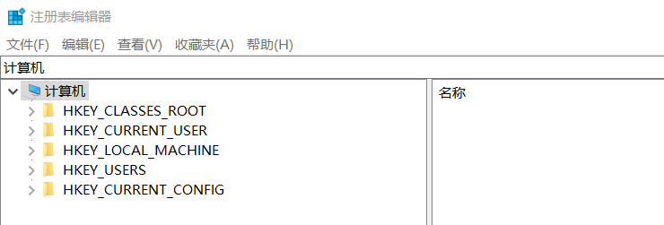
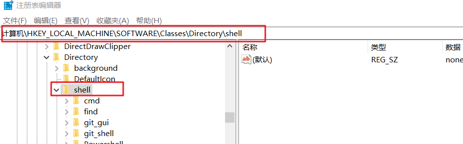
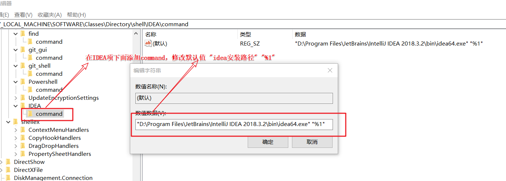
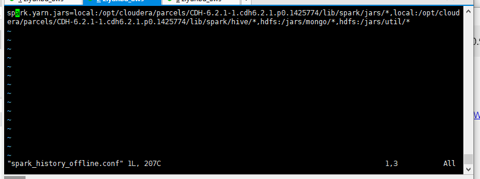

# git

1.git阿里镜像地址：http://npm.taobao.org/mirrors/git-for-windows

2.spark工具包https://spark-packages.org/

3.findjar.com

4.学习资源网站 https://www.zhihu.com/column/c_1252698235820523520

# demo

1.写个定时任务（shell,crontab）

（1）监控/flume/20??-??-??/目录下文件大小

（2）判断文件或文件夹的大小

（3）文件或文件夹大小超过100M报警，发邮件 

示例代码：

```
1.crontab -e
#*/1 * * * * sh /root/test/crontab_job.sh
表示一分钟执行一次
2.
#!/bin/bash

JOB_NAME="TEST"
FROM_EMAIL="haiersho666@163.com"
TO_EMAIL="1434591364@qq.com"

filelist=`hadoop fs -ls -d /flume/20??-??-??`
for file in $filelist
do

if [[ $file == /flume/20* ]]
then
#/bin/echo "=========================" >> /root/test/crontab_job.txt
#/bin/echo $file >> /root/test/crontab_job.txt
#hadoop fs -du -s -h $file
filesize=`hadoop fs -du -s -h $file`
#echo $filesize
#/bin/echo $filesize >> /root/test/crontab_job.txt
#echo $filesize
arr=($filesize)
tmp0=${arr[0]}
tmp=${arr[1]}
    if [[ $tmp == "M" ]]
    then
        if [[ $tmp0 > 5.0 ]]
        then
        echo $filesize
        echo -e "`date "+%Y-%m-%d %H:%M:%S"` : The file($filesize) size exceeds 5M ......" | mail \
        -r "haiershao: alertAdmin <${FROM_EMAIL}>" \
        -s "Warn: Skip the new $JOB_NAME spark job." ${TO_EMAIL}

        fi
    fi
fi
done

```

2.mysql数据到hive

需求：hive表格式orc,hive表压缩方式LZO。分区采用静态分区和动态分区

实现方式1：通过sqoop导入到hive

实现方式2：通过spark程序


3.java打包依赖

```xml
<build>
  <plugins>
   <plugin>
    <artifactId>maven-compiler-plugin</artifactId>
    <version>2.3.2</version>
    <configuration>
     <source>1.8</source>
     <target>1.8</target>
    </configuration>
   </plugin>
   <plugin>
    <artifactId>maven-assembly-plugin </artifactId>
    <configuration>
     <descriptorRefs>
      <descriptorRef>jar-with-dependencies</descriptorRef>
     </descriptorRefs>
     <archive>
      <manifest>
       <mainClass>com.bigdata.mr.WordcountDriver</mainClass>
      </manifest>
     </archive>
    </configuration>
    <executions>
     <execution>
      <id>make-assembly</id>
      <phase>package</phase>
      <goals>
       <goal>single</goal>
      </goals>
     </execution>
    </executions>
   </plugin>
  </plugins>
 </build>
```

# 异常

```xml
1.object is not a member of package
重装idea
卸载idea时勾选对选框，清除idea缓存
2.could not find implicit value for evidence parameter of type org.apache.flink.api.common..
解决办法：import org.apache.flink.streaming.api.scala._
将artifactId中例如flink-scala_2.11下划线后的版本号与当前配置的scala的版本号保持一致
3.FlinkKafkaConsumer011包倒不进，需要在pom中添加flink-connector-kafka-0.11_2.11小版本号
4.对于scala来说，一般jar包冲突是artifactId中对应的scala版本与idea版本不一致问题
4.java.lang.NoClassDefFoundError: Could not initialize class com.ziyun.historystatus.util.MysqlUtil$
驱动加载有问题、connection为空
5.打jar包问题 一直不是最新的jar说明idea需要开启自动编译
6.java.sql.SQLException: Can not call getNString() when field's charset isn't UTF-8 
解决方案：也可能是传进去的sql中的参数数据类型问题
7.import lombok.Getter;
import lombok.Setter;
idea需要安装lombok插件
8.maven pom中添加这个标签，不被打jar包中<scope>provided</scope>
```

# 如何添加文件右键用idea打开！

```xml
1. 打开注册表
　　win+R键输入regedit
2. 找到  【计算机\HKEY_LOCAL_MACHINE\SOFTWARE\Classes\Directory\shell】路径

　　　　　　找不到的，可以直接复制改路径定位
 新建项（K）IDEA，然后选中添加字符串值
在IDEA下面新增项command， 修改默认值为 "安装路径" "%1"
3. 重启后看效果！！
```









sql查找重复数据

```xml
Select start_time,end_time From lh_history_status_info_test_46 where device_id = '16057' group by start_time,end_time having count (*)>1
```

# 常用命令

```xml
1.yarn
yarn logs -applicationId
yarn application -kill 
2.spark提交
./bin/spark-submit --master yarn --deploy-mode cluster --num-executors 3 --executor-cores 1 --executor-memory 2G --name OperationRateCal_Test --conf spark.executor.memoryOverhead=1g --properties-file /home/ubuntu/spark_job/project/new_project/spark_history_offline.conf --class com.ziyun.operationrate.start.OperationRateCal /home/ubuntu/spark_job/project/new_project/operation_rate-1.0-SNAPSHOT.jar
3.flink提交
bin/flink run -m yarn-cluster -yn 2 -yjm 2048 -ytm 2048 -ynm FlinkHistoryStatusCal_15min_140 /home/ubuntu/flink_job/project/new_history_status/flinkkafkatohistorystatuscal-1.0-SNAPSHOT-jar-with-dependencies.jar
4.shell命令
ssh登录这些节点
5.查看端口号占用 netstat -anp|grep 8118
ps -ef|grep kafka
查看磁盘空间
df -Th
查看文件大小
du -sh 111.log
显示文本号
:set nu
```

